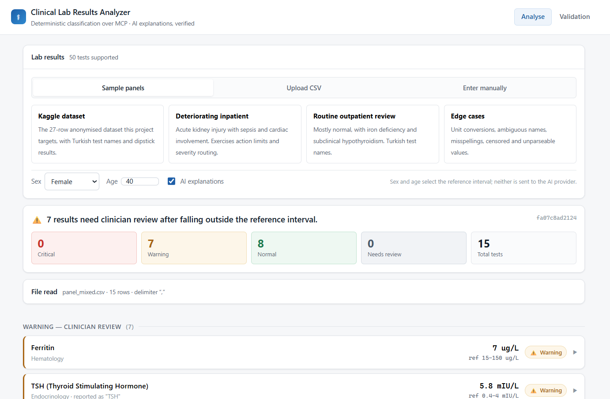
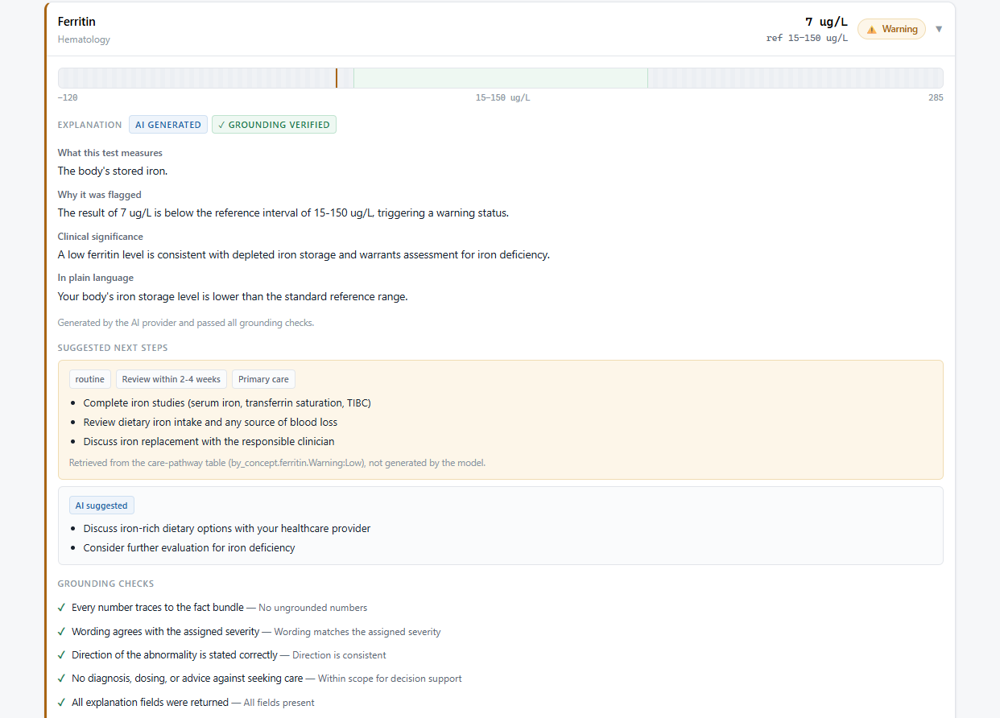
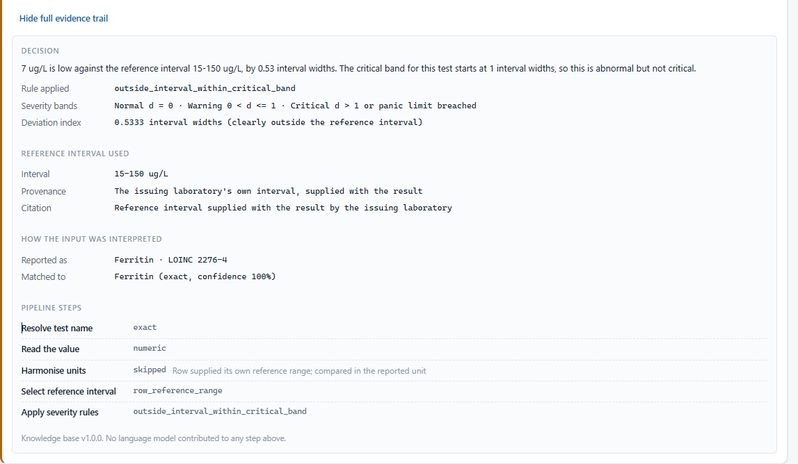
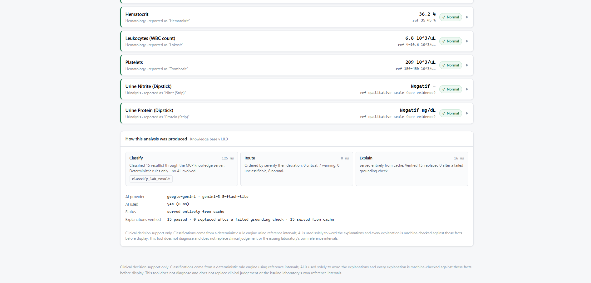
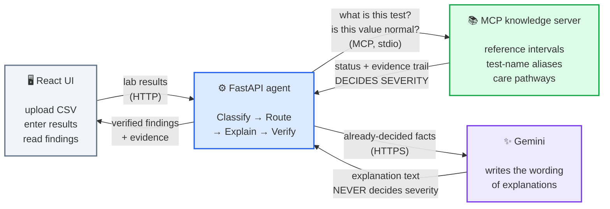
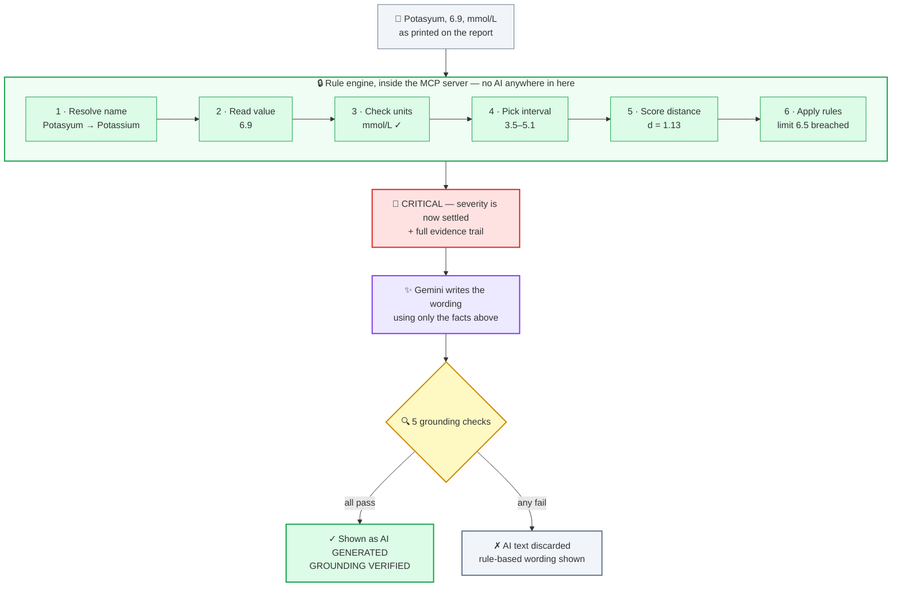

# Clinical Lab Results Analyzer

A full-stack tool that classifies laboratory results as **Critical / Warning / Normal**,
routes them by severity, and explains each one in clinically relevant language — with
every explanation checked against the facts it was generated from before a user sees it.

**The design decision everything else follows from: the language model never decides
severity.** Classification is deterministic, reproducible and unit-tested. The model is
used only to put already-settled facts into words, and its output is machine-verified and
discarded if it fails. That is what makes the AI here safe to put in front of a clinician.

---

## Contents

- [What it does](#what-it-does)
- [Screenshots](#screenshots)
- [Architecture](#architecture)
- [The classification engine](#the-classification-engine-the-hard-part)
- [Grounding the AI](#grounding-the-ai)
- [Validation: 100% agreement with the dataset labels](#validation)
- [Setup](#setup)
- [How to test it](#how-to-test-it)
- [API reference](#api-reference)
- [Project layout](#project-layout)
- [Design decisions and trade-offs](#design-decisions-and-trade-offs)

---

## What it does

1. Accepts lab results by **CSV upload**, **manual entry**, or a **one-click sample panel**.
2. Classifies each result through an **MCP server** that owns all clinical knowledge.
3. **Routes** by severity — critical first, then warnings, then rows needing human review,
   then normal.
4. **Explains** every result with Gemini, in one batched call for the whole panel.
5. **Verifies** each explanation against its fact bundle, and falls back to deterministic
   text if a check fails.
6. Attaches **protocol next steps** from a curated care-pathway table, kept visually
   separate from anything the model suggested.

Every result carries a full evidence trail: how the name resolved, how the value parsed,
any unit conversion applied, which reference interval was used and where it came from, the
deviation index, and the exact rule that fired.

---

## Screenshots

### Triage view

Results are grouped by severity, and the counts across the top are the first thing you
read. Test names are shown resolved, with the original underneath — `Lökosit` appears as
*Leukocytes (WBC count) · reported as "Lökosit"* — so nothing is silently renamed.



### An explanation, and the checks it had to pass

The gauge places the value against its reference interval. The explanation is labelled
**AI GENERATED** and **✓ GROUNDING VERIFIED**, and the five checks it passed are listed
at the bottom rather than summarised as a tick.

Note the two separate blocks of next steps: protocol actions **retrieved from the
care-pathway table** are visually distinct from the ones the model **suggested**.



### The evidence trail behind the severity

Every result can be opened to show exactly how its status was reached: the rule that
fired, the severity bands, the deviation index, which reference interval was used **and
where that interval came from**, and each pipeline step.

The footer states it plainly — *no language model contributed to any step above*.



### How the analysis was produced

Every run reports its own pipeline: the MCP tool calls made during classification, how the
results were routed, and how many explanations were verified versus replaced.



---

## Architecture

### The three parts, and who is allowed to decide what



**Read it in one line:** the UI sends results to the agent, the agent asks the MCP
knowledge server what they mean, and Gemini is handed the answer afterwards purely to put
it into words.

The green box is the only thing that assigns a severity. The purple box never does — it
receives facts that are already settled and writes prose about them. That separation is
the whole design.

### What happens to a single result



Colours match the first diagram: **green is deterministic** and **purple is the model**.
The severity is red because by that point it is final — nothing downstream can change it.

Steps 1–6 run inside the MCP knowledge server and involve no AI at all. Only after a
severity exists does the model get involved, and even then its output has to survive the
checks before anyone sees it.

**MCP tools the agent can call:** `classify_lab_result` · `reference_range_lookup` ·
`resolve_test_name` · `care_pathway_lookup` · `parse_reference_range` · `list_catalog`

**React components:** `LabInput` · `ResultsDisplay` · `SeverityBadge` · `ResultCard` ·
`EvidencePanel` · `RangeGauge` · `ValidationPanel`

**All agent communication with clinical knowledge goes through MCP.** The FastAPI layer
holds no reference ranges, no alias table and no care pathways of its own — it opens a
stdio MCP session at startup and calls tools. Every tool call the agent made is reported
back in the response, so the reasoning is auditable rather than taken on trust.

The MCP session is owned by a single long-lived background task. Request handlers never
enter or exit the session context themselves, which avoids the "exit in a different task"
failure that nested async context managers produce under a FastAPI lifespan.

Because the knowledge server is a real MCP server, it can also be driven by any other MCP
client — see [`docs/mcp-client-config.md`](docs/mcp-client-config.md).

---

## The classification engine (the hard part)

The assignment's real difficulty is not calling an LLM — it is classifying reliably. The
target dataset makes that concrete: test names are in Turkish, some values are words
rather than numbers, and units vary. Here is how each problem is handled.

### 1. Test-name resolution, in four escalating stages

| Stage | Example | Confidence |
|---|---|---|
| Exact concept key | `Hemoglobin` | 1.00 |
| Alias table (Turkish, English, abbreviations) | `Trombosit` → Platelets | 1.00 |
| Unit-based disambiguation | `PCT` + `%` → Plateletcrit; `PCT` + `ng/mL` → Procalcitonin | 0.90 |
| Fuzzy match, flagged | `Hemoglobinn` → Hemoglobin | ratio, ≥ 0.86 |
| Otherwise | `Zorblatt Factor` → **Unknown**, routed to a human | — |

Two deliberate refusals:

- **`Lökosit` and `Lökosit (Strip)` are kept separate.** One is a blood white-cell count,
  the other a urine dipstick pad. The normaliser preserves the `(Strip)` qualifier
  specifically so they cannot merge — collapsing them would be a clinically dangerous bug
  that a naive "strip punctuation" normaliser walks straight into.
- **Names shorter than four characters are never fuzzy-matched.** `Ka` should not become
  `Ca`. A wrong test identity is worse than an honest Unknown.

### 2. Value parsing

Numbers, censored results (`<0.01` keeps its operator — it is not the same claim as
`0.01`), decimal commas (`0,87` → 0.87) distinguished from thousands separators
(`1,020` → 1020, with a note recording the ambiguity), and a qualitative vocabulary in
both languages (`Negatif`, `Eser`, `1+`, `Pozitif`, `Normal`).

### 3. Unit harmonisation — and refusing when it cannot

Each concept declares the units it accepts and the factor converting each into its
canonical unit. Haemoglobin reported as `13 mmol/L` becomes `20.94 g/dL` and classifies as
**Critical**, where treating the number as `g/dL` would have called it Normal.

If a unit is not recognised for that test, the engine **refuses to classify** and flags
`unit_mismatch`. Silently comparing mg/dL against mmol/L is exactly the class of error
that this refusal exists to prevent.

### 4. Reference-interval selection, with provenance

Ranked, and the choice is always cited:

1. **The interval supplied with the row** — the issuing laboratory's own interval is
   authoritative and outranks ours.
2. **The knowledge base**, sex- and age-adjusted.
3. **`reference_range_lookup`** over MCP for names the catalogue did not match directly —
   the assignment's optional tool, used where it earns its place. It cannot invent an
   interval, but it returns near-miss candidates that turn a dead end into an actionable
   *"did you mean…"*.

### 5. The severity rule

A single normalised measure works across tests whose scales differ by orders of magnitude:

```
d = (value − high) / width        if above the interval
d = (low − value) / min(width, low)   if below
width = high − low
```

| Condition | Status |
|---|---|
| `d = 0` | **Normal** (flagged `borderline` within 5% of a bound) |
| `0 < d ≤ critical_band` | **Warning** |
| `d > critical_band` | **Critical** |
| Absolute action limit breached | **Critical**, regardless of `d` |

Three details that matter:

- **Action limits ("panic values") override the ratio.** Potassium 6.9 mmol/L is only 1.1
  interval widths out, but it is a cardiac emergency. A ratio alone would under-call it.
- **The low side is normalised by `min(width, low)`.** For analytes bounded at zero —
  ferritin 15–150, B12 200–900 — the interval is far wider than the gap from the lower
  bound to zero, so a plain width normalisation is nearly blind to severely low results.
- **`critical_band` defaults to 1.0 but lives in the knowledge base.** Fasting glucose has
  a narrow physiological interval (70–99) and a wide clinically tolerable range, so 130
  mg/dL must be a Warning, not Critical. That is a data change, not a special case in code.

Qualitative results use a per-test grading scale: for urine ketones `1+` is a Warning
while `2+` is Critical; for protein `2+` is still a Warning. Grades the scale does not
define return Unknown rather than a guess.

### 6. Routing

Sorted by severity, then by deviation index descending, so the most abnormal result in a
group is the first one read. Critical results are expanded by default — the point of
triage is that urgent things do not need a click.

---

## Grounding the AI

The model receives a **fact bundle** and nothing else: test name, value as reported, the
converted figure if a conversion was applied, the reference interval, the status, the
direction, and the engine's own rationale. No patient reference, no dates, no free text
from the uploaded file beyond the test name.

Every returned explanation then passes five checks before display:

| Check | What it catches |
|---|---|
| **Numeric grounding** | Any number not traceable to the fact bundle — the classic invented threshold ("levels above 7.8 mmol/L…"). Digits inside test names (`Vitamin B12`, `1.73m²`) are allowed. |
| **Status consistency** | Reassuring language on a Critical result; alarming language on a Normal one. |
| **Direction consistency** | A high result described as being below the interval. |
| **Safety rails** | Definitive diagnosis, drug names or doses, or advice against seeking care. |
| **Completeness** | Empty fields. |

**It fails closed.** An explanation that fails any check is discarded and replaced with the
deterministic version, and the UI says so. The checks are shown in the UI with their
results, so a reviewer sees what was verified rather than being asked to trust a tick.

The deterministic fallback is itself tested against the same checker, so the fallback can
never trip the thing it is a fallback for.

### Efficiency

- **One batched request per panel**, not one per result. Every result still gets its own
  model-authored explanation; a 27-row CSV costs one call rather than 27. On a free tier
  that is the difference between a working demo and a rate-limit error.
- **Cached on the grounded facts**, not the patient row — same test, same status, same
  rounded value gives the same explanation, so repeated panels are largely free.
- **Degrades rather than fails.** Missing key, exhausted quota, timeout, or malformed JSON
  all fall back to rule-based text, and `/health` and the response both say exactly what
  happened.

---

## Validation

The Kaggle dataset ships a clinician-assigned `Status` per row, which makes it a genuine
held-out check rather than a self-graded demo. The classifier never sees that column.

```
GET /evaluate  →  100.0% agreement (27 / 27 rows)
```

That includes all 27 Turkish test names, the qualitative dipstick rows, and the one
abnormal row (`Eritrosit (Strip)` = `1+`, labelled `Yüksek`). Visible in the app under the
**Validation** tab, and pinned by a test so a regression fails the suite.

Agreement is scored on abnormality *and* its direction. The engine additionally separates
Warning from Critical — a distinction the dataset does not make — so that split is
validated by the unit tests instead.

---

## Setup

**Prerequisites:** Python 3.11+, Node 18+.

### Backend

```bash
cd backend
python -m venv .venv
.venv\Scripts\activate          # Windows
# source .venv/bin/activate     # macOS / Linux
pip install -r requirements.txt
cp .env.example .env
```

Add a free Gemini key to `backend/.env` — get one at
[aistudio.google.com/apikey](https://aistudio.google.com/apikey):

```ini
GEMINI_API_KEY=your_key_here
GEMINI_MODEL=gemini-2.0-flash
```

Then start it **with the virtualenv's interpreter**, not a bare `python`:

```bash
.venv\Scripts\python.exe run.py
```

Dependencies live in `backend/.venv`. If another Python is first on your PATH
(Anaconda is the usual culprit) a bare `python run.py` cannot import `mcp` and the
app will not start. `run.py` checks this up front and tells you which interpreter
to use rather than failing obscurely.

API on `http://127.0.0.1:8000`, interactive docs at `/docs`.

> **Start it with `run.py`, not `uvicorn --reload`.** On Windows, uvicorn switches
> to `WindowsSelectorEventLoopPolicy` whenever reload is enabled, and that event
> loop cannot spawn subprocesses. The MCP knowledge server *is* a subprocess, so
> it fails to start with a bare `NotImplementedError` and every classification
> returns 503. `run.py` passes `loop="none"` to keep the Proactor loop, and hot
> reload still works. If you do call uvicorn directly, omit `--reload` (the CLI
> does not accept `--loop none`; only `uvicorn.run(loop="none")` does).
> `/health` will tell you if you hit this.

> **Without a key the app still runs end to end** in rule-based mode. Classification is
> identical — it never uses AI — and explanations come from the deterministic templates.
> The UI shows a banner saying so.

### Frontend

```bash
cd frontend
npm install
npm run dev
```

Open `http://localhost:5173`. Vite proxies `/api` to the backend, so there is no CORS
setup and no environment variable to point it at the API.

---

## How to test it

```bash
cd backend
.venv\Scripts\python -m pytest -q      # 86 tests
```

Coverage is concentrated where correctness matters: every severity decision is pinned to
an exact expected value, every grounding check has a test that trips it, and the Kaggle
agreement is a regression test.

### Try these in the UI

| Try | What it demonstrates |
|---|---|
| **Sample panels → Kaggle dataset** | Turkish names and dipstick values classified end to end |
| **Sample panels → Deteriorating inpatient** | Action limits, severity routing, escalation pathways |
| **Sample panels → Edge cases** | Every failure mode below, in one panel |
| **Validation tab** | 100% agreement against the dataset's own labels |
| Expand a result → *Show full evidence trail* | The complete audit trail behind one flag |
| Toggle **AI explanations** off and re-run | The deterministic explanations on their own |

Edge cases in `test_data/panel_edge_cases.csv`:

| Input | Result |
|---|---|
| `Hemoglobin 13.0 mmol/L` | Converted to 20.9 g/dL → **Critical** |
| `Hemoglobin 13.0 furlongs` | **Unknown** — refuses to compare incompatible units |
| `Hemoglobinn 13.1 g/dL` | Fuzzy-matched, flagged *Test name inferred* |
| `PCT 0.27 %` / `PCT 3.2 ng/mL` | Same name, resolved to two different tests by unit |
| `PCT 0.27` (no unit) | **Unknown** — ambiguous, not guessed |
| `Lökosit` vs `Lökosit (Strip)` | Kept as two distinct tests |
| `Troponin I <3 ng/L` | Censored value, operator preserved |
| `Glucose 130 mg/dL` | **Warning**, not Critical — band override |
| `Platelets 155` | **Normal**, flagged *Borderline* |
| `Ferritin abc` | **Unknown** — unparseable, routed to a human |
| `Zorblatt Factor 5 x` | **Unknown** — not invented |

---

## API reference

| Method | Path | Purpose |
|---|---|---|
| `POST` | `/analyze_labs` | **The assignment's endpoint.** Classify, route and explain. |
| `POST` | `/analyze_csv` | Upload a CSV and analyse it in one step. |
| `POST` | `/analyze_sample/{id}` | Analyse a bundled panel. |
| `GET` | `/samples` | List the bundled panels. |
| `GET` | `/catalog` | Supported tests, for the frontend picker. |
| `GET` | `/evaluate` | Classifier accuracy against the labelled dataset. |
| `GET` | `/health` | MCP session and AI provider status. |

```bash
curl -X POST http://127.0.0.1:8000/analyze_labs \
  -H "Content-Type: application/json" \
  -d '{
    "labs": [
      {"test_name": "Potasyum", "value": "6.9", "unit": "mmol/L"},
      {"test_name": "Hemoglobin", "value": "9.1", "unit": "g/dL"},
      {"test_name": "Nitrit (Strip)", "value": "Pozitif"}
    ],
    "patient": {"sex": "female", "age_years": 34}
  }'
```

Errors are explicit: invalid lab names return `Unknown` with candidates rather than a
crash, missing values are skipped with a per-row warning, unreachable MCP returns `503`
pointing at `/health`, and unusable CSVs return `400` naming the columns that were found.

---

## Project layout

```
backend/
  app/
    main.py          FastAPI endpoints
    agent.py         Classify → Route → Explain → Verify
    mcp_client.py    Persistent stdio MCP session
    llm.py           Gemini provider: batching, caching, retries, graceful failure
    verifier.py      Grounding checks + deterministic fallback explanations
    csv_ingest.py    Synonym-based column mapping
    schemas.py       Pydantic request/response contract
  mcp_server/
    server.py        MCP tools
    engine.py        The deterministic classifier
    knowledge/       reference_ranges · aliases · care_pathways  (JSON, not code)
  tests/             86 tests
frontend/
  src/components/    LabInput · ResultsDisplay · SeverityBadge · ResultCard
                     EvidencePanel · RangeGauge · ValidationPanel
test_data/
  kaggle_lab_test_results_public.csv   the target dataset (CC0)
  panel_critical.csv · panel_mixed.csv · panel_edge_cases.csv
```

Clinical knowledge lives in **JSON, not Python**. Adding a test, adjusting an interval or
changing a care pathway is a data edit — no code change, no redeploy of logic.

---

## Design decisions and trade-offs

**Why classify deterministically instead of asking the model?**
Reproducibility, testability and auditability. An LLM classifier cannot be pinned to an
expected value in a unit test, cannot explain which rule fired, and can silently change
its mind between runs. Severity decisions drive escalation, so they need to be the part
you can prove. The assignment's own FAQ asks for the LLM on explanations, and this
separation honours that while making the classification defensible.

**Why one batched LLM call instead of one per result?**
The requirement is that every result gets a model-authored explanation, and every result
does. Batching changes only the transport. Per-result calls would multiply latency by the
row count and exhaust a free-tier quota on the first CSV.

**Why verify the model's output at all?**
Because "sounds clinical" and "is grounded" are different properties, and only one of them
is checkable. The verifier is ~150 lines and catches the failure that matters most in this
domain — a confident number nobody supplied.

**What I would do next, with more than a day:**
delta checks against previous results (a haemoglobin falling 3 g/dL in a day matters more
than its absolute value), age-banded paediatric intervals, real LOINC coding via a
terminology service rather than the illustrative codes here, and persistence so panels can
be tracked over time.

### Limitations, stated plainly

- Reference intervals are illustrative adult values, not any specific laboratory's. Real
  deployment must use the issuing lab's own intervals — which is why a row-supplied
  interval already takes precedence.
- Age-banded and paediatric intervals are supported by the schema but not populated.
- The verifier is a regex-and-arithmetic checker, not a semantic one. It reliably catches
  ungrounded numbers, contradictions and unsafe phrasing; it will not catch a fluent,
  correctly-numbered but clinically unhelpful sentence.
- Decision support only. It does not diagnose.

---

## Credits

Dataset: [Laboratory Test Results – Anonymized Dataset](https://www.kaggle.com/datasets/pinuto/laboratory-test-results-anonymized-dataset)
by *pinuto* on Kaggle, released under CC0 1.0 and bundled in `test_data/`.

AI provider: Google Gemini free tier (`gemini-2.0-flash`), configurable via `GEMINI_MODEL`.
